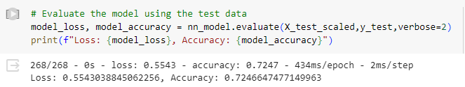
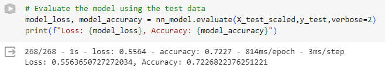
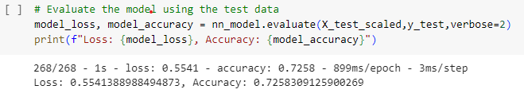

# Deep Learning Challenge

# REPORT ON NEURAL NETWORK MODEL

### Background
The nonprofit foundation Alphabet Soup wants a tool that can help it select the applicants for funding with the best chance of success in their ventures. With your knowledge of machine learning and neural networks, you’ll use the features in the provided dataset to create a binary classifier that can predict whether applicants will be successful if funded by Alphabet Soup.

### Process
Utilize the following steps to prepare the data and compile, train and evaluate a neural network model:

1. Preprocess the Data
2. Compile, train and evaluate
3. Optimize the Model by adjusting any of the following:
    * Dropping more or fewer columns.
    * Creating more bins for rare occurrences in columns.
    * Increasing or decreasing the number of values for each bin.
    * Add more neurons to a hidden layer.
    * Add more hidden layers.
    * Use different activation functions for the hidden layers.
    * Add or reduce the number of epochs to the training regimen.

### Report
**1. Overview**: The purpose of this analysis is to help Alphabit Soup predict whether applicants will be successful if funded. This will help it determine the most likely applicants to succeed and act accordingly.

**2. Results**: 

*Target variable:*
  * **IS_SUCCESSFUL**

*Feature variables:*
  * **APPLICATION_TYPE**&mdash;Alphabet Soup application type
  * **AFFILIATION**&mdash;Affiliated sector of industry
  * **CLASSIFICATION**&mdash;Government organization classification
  * **USE_CASE**&mdash;Use case for funding
  * **ORGANIZATION**&mdash;Organization type
  * **STATUS**&mdash;Active status
  * **INCOME_AMT**&mdash;Income classification
  * **SPECIAL_CONSIDERATIONS**&mdash;Special considerations for application
  * **ASK_AMT**&mdash;Funding amount requested

*Removed variables:*
* **EIN**: Identification columns
* **NAME**: Identification columns

Compiling, Training, and Evaluating the Model:

I build the first model with the following parameters:
* 2 hidden layers with 15 neurons each and an activation function of tanh. This resulted in 2011 total parameters.
* Output node is 1 since we're working with a binary classifier model with one output to answer the question: is the applicant likely to succeed or fail if funded? The output layer activation function sigmoid is used given the model output is a binary classification between 0 and 1. 

After running the model we evaluate and find we have an accuracy of just over 72%.

For the second model, I decided to change the activation functions to relu and lower the neurons for each to 10. 

For the third model, I decided to add in a 3rd hidden layer but lower the neurons for each to 10. I also changed the activation functions for the first and third hidden layers to relu.

I decided to experiment with changing the number of nodes and neurons, and the activation function. However, none of my models could break the 75% threshold.

**3. Summary**: The best of the three models by a narrow margin was the third and final model which consisted of 3 hidden layers with 10 neurons each, varying activation functions and 50 training epochs. This model achieved an accuracy score of 72.58%. Additional changes to consider include additional neurons and hidden layers.